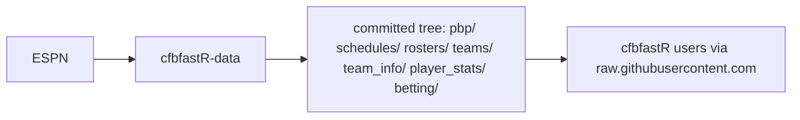
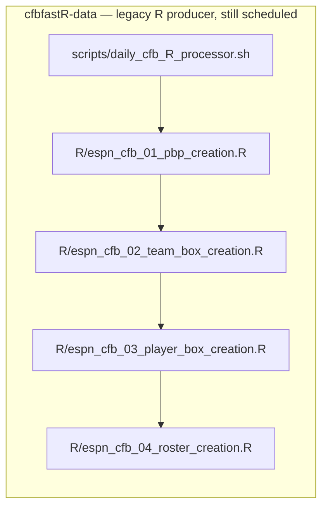

## __cfbfastR-data__ 
[](https://twitter.com/cfbfastR) 
[](https://twitter.com/saiemgilani) 
<a href="https://github.com/saiemgilani" target="blank"></a>

### __cfbfastR data 2002-2020__

## cfbfastR-data workflow diagram





This repo commits datasets to its own tree (consumed over
`raw.githubusercontent.com`, per the snippets below). The `espn_cfb_*` release
tags on `sportsdataverse-data` are produced by the successor
[cfbfastR-cfb-data](https://github.com/sportsdataverse/cfbfastR-cfb-data)
python pipeline — not from here.

[cfbfastR-cfb-raw repository (source: ESPN)](https://github.com/sportsdataverse/cfbfastR-cfb-raw)

[cfbfastR-cfb-data repository (modeling + releases)](https://github.com/sportsdataverse/cfbfastR-cfb-data)

## RDS
```
seasons <- 2002:2020
pbp <- purrr::map_df(seasons, function(x) {
  readRDS(
    url(
      glue::glue("https://raw.githubusercontent.com/sportsdataverse/cfbfastR-data/master/pbp/rds/play_by_play_{x}.rds")
    )
  )
})
```

## CSV (compressed)

```
seasons <- 2002:2020
pbp <- purrr::map_df(seasons, function(x) {
  readr::read_csv(
    url(
      glue::glue("https://raw.githubusercontent.com/sportsdataverse/cfbfastR-data/master/pbp/csv/play_by_play_{x}.csv.gz")
    )
  )
})
```

## Parquet (arrow)
```
seasons <- 2002:2020
pbp <- purrr::map_df(seasons, function(x) {
  download.file(glue::glue("https://raw.githubusercontent.com/sportsdataverse/cfbfastR-data/master/data/parquet/play_by_play_{x}.parquet"),"tmp.parquet")
  df <- arrow::read_parquet("tmp.parquet")
  return(df)
})
```

## Repository layout

<!-- BEGIN GENERATED: layout -->

```
cfbfastR-data/
├── R/   # R pipeline stages and publish toolchain
│   ├── 0000_create_cfbfastR_releases_init.R
│   ├── 0001_push_existing_release_data.R
│   ├── espn_cfb_01_pbp_creation.R
│   ├── espn_cfb_02_team_box_creation.R
│   ├── espn_cfb_03_player_box_creation.R
│   ├── espn_cfb_04_roster_creation.R
│   ├── make_pbp_commit.R
│   └── models_prep.R
├── betting/
│   ├── csv/
│   ├── parquet/
│   └── rds/
├── cfb/
│   ├── pbp/
│   ├── roster/
│   └── schedules/
├── data/   # committed datasets
│   ├── parquet/
│   └── rds/
├── dev/   # working notes, not part of the pipeline
│   ├── _sched_release/
│   └── _sched_stage/
├── figures/   # generated figures
├── models/   # model artifacts, cards and the registry
├── pbp/
│   └── parquet/
├── player_stats/
│   ├── csv/
│   ├── parquet/
│   └── rds/
├── rosters/
│   ├── csv/
│   ├── parquet/
│   └── rds/
├── schedules/
│   ├── csv/
│   ├── parquet/
│   └── rds/
├── scripts/   # bash drivers (the daily/weekly entry points)
│   └── daily_cfb_R_processor.sh
├── team_info/
│   ├── parquet/
│   └── rds/
├── teams/
└── themes/   # plot themes
    └── generators/
```

<!-- END GENERATED: layout -->

## Reports & explainers

<!-- BEGIN GENERATED: reports -->

| Report | What it is | Last updated |
|---|---|---|
| _none yet_ | — | — |

<!-- END GENERATED: reports -->

## Automation & status

<!-- BEGIN GENERATED: status -->

| workflow | schedule | last run |
|---|---|---|
| [](https://github.com/sportsdataverse/cfbfastR-data/actions/workflows/daily_cfb.yml) | day 1 04:05 UTC in Jan-Aug; Mondays 06:30 UTC in Sep-Dec; Sundays 06:30 UTC in Sep-Dec; Saturdays 16:00 UTC in Sep-Dec; Saturdays 20:15 UTC in Sep-Dec; daily 04:05 UTC in Jan, Dec | 2026-08-30 |
| [](https://github.com/sportsdataverse/cfbfastR-data/actions/workflows/update_rosters.yml) | on dispatch | 2026-08-30 |

<!-- END GENERATED: status -->
